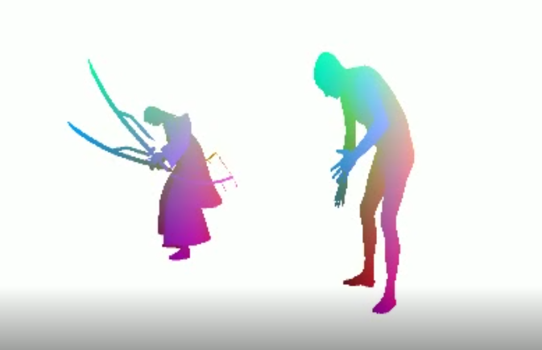

# Pose2Carton 

EE228 课程大作业，利用3D骨架控制3D卡通人物。

# Maya 环境配置

从官网下载安装maya
  
  1）在官网：https://www.autodesk.com.cn/products/maya/overview 申请autodesk账户，并申请教育版权限。
  
  2）通过maya2020安装包的链接，安装maya2020。
  
  3）安装完成后，运行maya2020

安装pip与numpy
  
  1)	将maya2020安装目录下bin文件夹路径添加到系统环境变量。
  
  2)	能在cmd中运行mayapy即可。
  
  3)	安装pip
      
      打开maya，打开cmd，输入：
      
      curl https://bootstrap.pypa.io/pip/2.7/get-pip.py -o get-pip.py
      mayapy get-pip.py
  
  4)  安装numpy
      
      在cmd中运行：
      
      mayapy -m pip install -i https://pypi.anaconda.org/carlkl/simple numpy

在mayapy中import库检查是否能够运行

在cmd中运行 mayapy fbx_parser.py xxxx.fbx ，运行成功即可

# 匹配流程

无蒙皮流程：

1.	transfer.py最后一行去掉注释，将第一个文件名改为要匹配的文件名，把use_online_model改为false，运行一遍transfer.py，查看输出结果：tranfser.py会输出节点和名字的匹配关系。

2.	对字典manual_model_to_smpl中的节点信息匹配，左边的是要匹配的节点名，右边则是给定的模型的节点。

3.	匹配完之后，再运行一遍transfer.py即可对模型节点匹配，并会生成pkl文件和obj_seq_5_3dmodel文件夹，这个文件夹包含对应obj_seq_5中各个模型动作的模型。

4.	匹配完成之后，运行vis.py进行可视化，观察节点之间的对应关系是否正确。如果匹配正确，则保存此次vis生成的mp4视频。

有蒙皮流程：

1.	将下载的模型png贴图文件复制到obj_seq_5_3dmodel文件夹下。
	
2.	在有fbx_parser.py目录下打开cmd，运行命令mayapy fbx_parser.py path/to/fbx/xxxx.fbx(xxxx.fbx为要匹配的文件名)，fbx_parser.py会生成有节点关系的txt文件，intermediate.obj和蒙皮使用的intermediate.mtl文件。
	
3.	将生成的.mtl复制到obj_seq_5_3dmodel文件夹下。

4.	打开生成的.mtl文件，通过观察obj序列文件分别找出每个mesh对应的png文件，对其做map_Kd操作，依次修改每个mesh。

5.	把transfer.py的最后一行中use_online_model改为True,再把vis.py中的use_online_model改为True，接下来的节点匹配步骤与无蒙皮模型相同。

# 新增脚本说明

如果你写了自己的脚本来处理数据或进行可视化，请在这里进行相关说明(如何使用等)； 如果没有，请忽略该模块。

# 项目结果

这里放置来自你最终匹配结果的截图， 如

# 协议 
本项目在 Apache-2.0 协议下开源

所涉及代码及数据的最终解释权归倪冰冰老师课题组所有

Group 毛思羽&张奕涵  519030910342 & 519030910341
